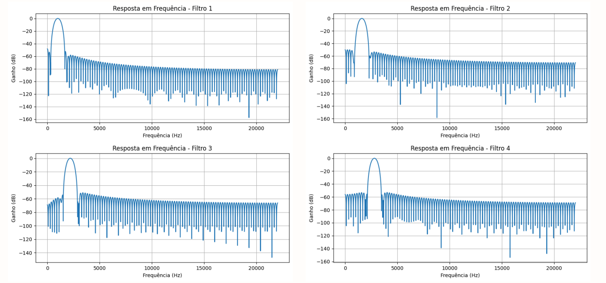
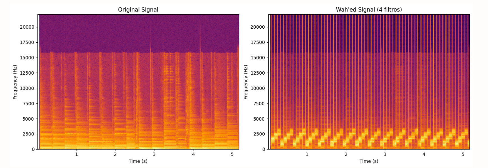

# Wah-Wah Effect with FIR Band-Pass Filters

This project simulates the Wah-Wah effect, widely used in electric guitars, by sequentially applying FIR band-pass filters to an audio signal. The implementation was developed for academic purposes in the Digital Signal Processing course at the Federal University of Campina Grande (UFCG).

## Objective

Reproduce the Wah-Wah effect digitally by dynamically alternating band-pass filters over time, mimicking the frequency modulation typical of this effect in analog pedals.

## What is the Wah-Wah Effect?

The Wah-Wah effect is a modulation effect used extensively in electric guitar music. It mimics the human voice articulation of "wah" by sweeping a resonant filter back and forth across the frequency spectrum. This sweeping motion produces an expressive, vocal-like quality to the sound.

Traditionally, the effect is achieved using an analog pedal, where the musician controls the cutoff frequency of a low-pass or band-pass filter using foot movement. In most cases, the operational frequency range of the Wah-Wah effect lies between 500 Hz and 3000 Hz, where the human ear is particularly sensitive to spectral shifts, giving the effect its characteristic tone.

Digitally, this effect can be recreated by applying a series of filters over time or by modulating a filter's cutoff frequency dynamically. This project adopts the first approach by implementing five FIR band-pass filters that are applied cyclically to segments of an audio signal.

## Implementation Logic

This implementation emulates the Wah-Wah effect by using four fixed FIR band-pass filters, each designed to pass a specific frequency band. These filters are applied sequentially to short segments of the audio signal, effectively simulating a time-varying cutoff frequency.

Rather than modifying a single filter's cutoff dynamically, we approximate the sweep by alternating which filter is active in each time window. This creates the perception of movement across the frequency spectrum, which is characteristic of the Wah-Wah effect.

The four filters used in the project have the following frequency bands:

Filter 1: 500–1500 Hz

Filter 2: 1200–2000 Hz

Filter 3: 1800–2500 Hz

Filter 4: 2500–5000 Hz

By spacing these filter applications over time, the perceived center frequency moves gradually upward and then cycles back, simulating the opening and closing of a frequency gate. This variation in cutoff frequency across time is what generates the expressive, vowel-like modulation known as the Wah-Wah effect.
5. After filtering, a controlled gain is applied and the signal is normalized or clipped.
6. The processed signal is saved and analyzed using spectrograms and frequency response plots.

## Execution

To run the project and generate the Wah-Wah effect:

1. Install dependencies

pip install numpy scipy soundfile matplotlib

2. Run the Python script or notebook

You can use the Colab notebook provided in notebooks/WahwahFIR.ipynb or run the script manually with:

python src/wahwahfir.py

3. Output

After execution, the processed audio will be saved as:

wahwah_4filters.wav

The code divides the input audio into segments of 80 milliseconds and sequentially applies one of four FIR band-pass filters to each segment. This simulates a time-varying frequency sweep across the spectrum.

Each filter covers a specific frequency range:

Filter 1: 500–1500 Hz

Filter 2: 1200–2000 Hz

Filter 3: 1800–2500 Hz

Filter 4: 2500–5000 Hz

A gain of 3.0 is applied at the end of processing, and the signal is clipped to prevent overflow.

---bash
pip install numpy scipy soundfile matplotlib


### 2. Run the main script
```bash
python src/wahwahfir.py
````

3. Output

The audio with the effect will be saved as: wahwah_4filters.wav

## Filter Frequency Responses




## Spectrogram Analysis


To evaluate the impact of the FIR band-pass filters on the input audio signal, we performed a visual analysis through spectrograms. These plots allow us to track the energy distribution across the frequency spectrum over time.

Below, you can see a comparison between the original signal and the wah-wah processed signal using the four-band FIR filter alternation strategy.



## Observations and Future Work

This project successfully simulates the Wah-Wah effect using time-varying FIR bandpass filters. However, there are several areas for improvement and exploration:

 - Filter Configuration Exploration:
Future iterations will experiment with different frequency bands and bandwidths, as well as varying the number of active filters, to find configurations that produce more expressive or musically pleasant results.

 - Audio Quality Optimization:
Signal treatment techniques such as noise reduction, normalization, or dynamic range compression could improve the overall clarity and reduce artifacts introduced by filter switching.

 - Incorporating Distortion Effects:
A long-term goal is to add distortion—commonly found in real Wah-Wah pedal circuits—by introducing a nonlinear processing stage. One possibility is the use of IIR filters or soft clipping functions to simulate analog saturation.

These enhancements aim to bring the simulated effect closer to the warmth and character of real analog Wah-Wah pedals.

## Conclusion
This project demonstrates a functional and customizable digital emulation of the Wah-Wah audio effect using FIR bandpass filters. By alternating between multiple filter bands over time, it successfully mimics the sweeping resonance movement characteristic of analog pedals.

Beyond its implementation, this project serves as a learning platform for digital signal processing concepts such as filter design, time-based modulation, and real-time audio transformation. With further improvements in filter configuration, signal treatment, and distortion integration, this system has the potential to evolve into a versatile effect module for music processing or embedded audio applications.

